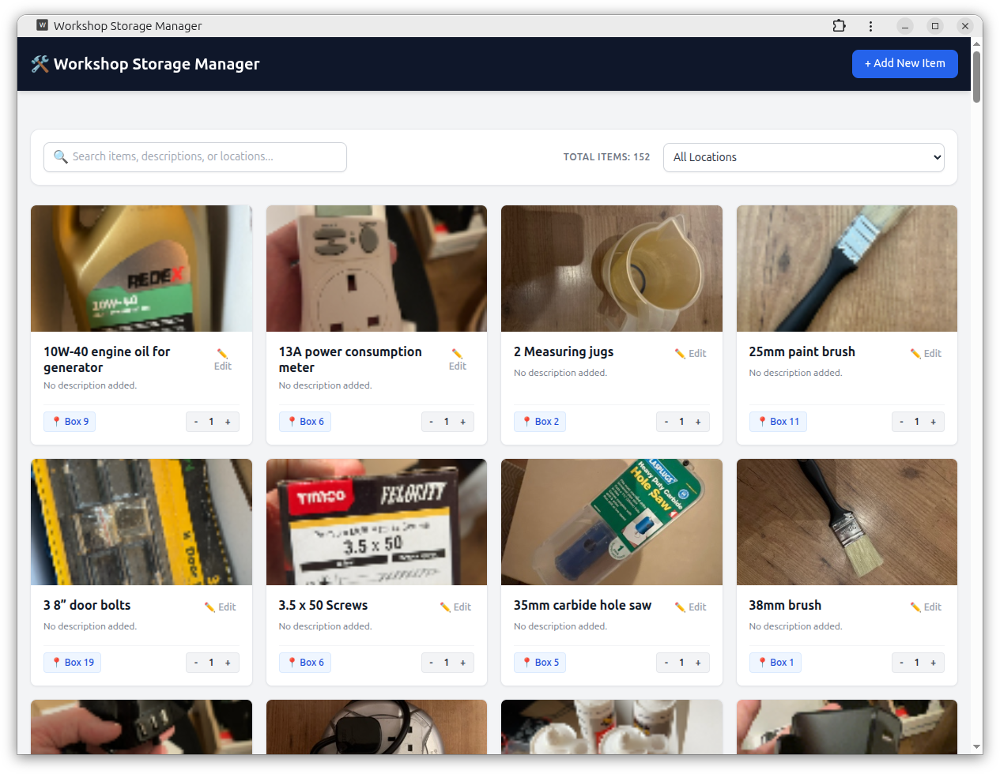
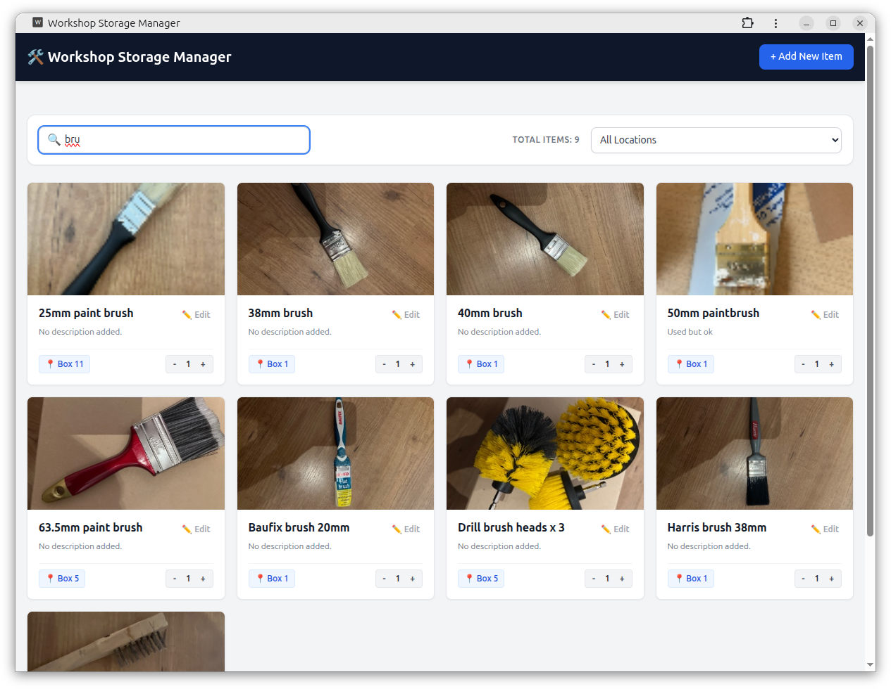
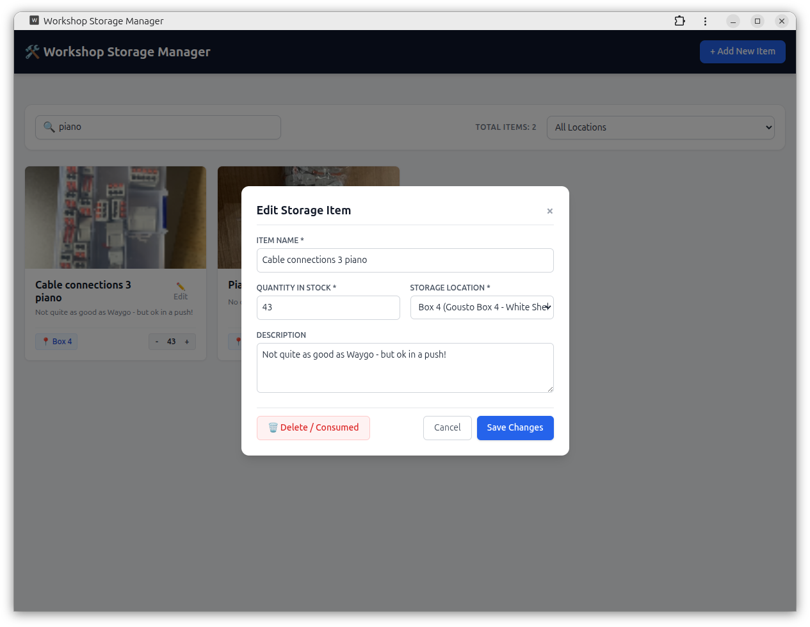

# 🛠️ Workshop Storage Manager (WhereDidIPut)

> **Why can I never find my......**  
> I had a load of cardboard boxes from Gousto so I wrote some numbers on them and shoved various items in to them as part of a big tidy up / hoy out.
> This little PWA will let me take a snap of items and note where they are.

> Okay - It is a bit of an effort but it really makes it easy to find things again.
> The alternate approach which sometimes works is to try to convince your brain that you are looking for a purple crocodile, then as you randomly check various drawers, cupboards and boxes, you will find all sorts of stuff.

---

## ✨ Features

- 📱 **Installable PWA** — Works seamlessly as a mobile app or desktop application straight from your browser.
- ⚡ **Instant Client-Side Filtering** — Filter by location or search descriptions instantly with live debounced search.
- 📦 **Stock & Quantity Counter** — Manage consumables with quick-adjust `+` and `-` buttons right on item cards.
- 📸 **Automatic Image Compression** — High-resolution photos taken on phone cameras are compressed locally before upload to save server bandwidth.
- ✏️ **Full CRUD Capabilities** — Easily create, update location/description, or mark items as consumed/deleted.
  
- 🏷️ **Dynamic Dropdowns** — Storage locations and material categories populate straight from your database.

---

## 🏗️ Architecture & Structure

Workshop Application
- index.html (SPA Frontend UI & PWA Registration)
- sw.js (Service Worker for static asset caching)
- manifest.json (App Manifest & Home Screen Metadata)
- photos/ (Compressed uploaded images)
- api/
  - config.php (Database Connection Setup)
  - materials.php (Search & Read Endpoint)
  - locations.php (Location Dropdown Data)
  - types.php (Material Type Dropdown Data)
  - create_material.php (Upload & Insert Endpoint)
  - update_material.php (Edit, Adjust Stock, or Delete)

---

## 🗄️ Database Setup

Run the following SQL snippet in your MySQL / PHPMyAdmin setup to build the database schema:

CREATE DATABASE IF NOT EXISTS `whereDidIPut` CHARACTER SET utf8mb4;
USE `whereDidIPut`;

CREATE TABLE `Locations` (
  `LocationID` INT AUTO_INCREMENT PRIMARY KEY,
  `Location` VARCHAR(100) NOT NULL,
  `LocationDescription` TEXT DEFAULT NULL
);

CREATE TABLE `MaterialTypes` (
  `MatTypeID` INT AUTO_INCREMENT PRIMARY KEY,
  `MaterialType` VARCHAR(100) NOT NULL
);

CREATE TABLE `Materials` (
  `MaterialID` INT AUTO_INCREMENT PRIMARY KEY,
  `Name` VARCHAR(255) NOT NULL,
  `MaterialDescription` TEXT DEFAULT NULL,
  `Quantity` INT NOT NULL DEFAULT 1,
  `Photo` VARCHAR(255) DEFAULT NULL,
  `MatTypeID` INT DEFAULT NULL,
  FOREIGN KEY (`MatTypeID`) REFERENCES `MaterialTypes`(`MatTypeID`) ON DELETE SET NULL
);

CREATE TABLE `WhereThingsAreStored` (
  `MappingID` INT AUTO_INCREMENT PRIMARY KEY,
  `MaterialID` INT NOT NULL,
  `LocationID` INT NOT NULL,
  FOREIGN KEY (`MaterialID`) REFERENCES `Materials`(`MaterialID`) ON DELETE CASCADE,
  FOREIGN KEY (`LocationID`) REFERENCES `Locations`(`LocationID`) ON DELETE CASCADE
);

---

## 🚀 Quick Start & Installation

1. **Clone the Repository**
   `git clone https://github.com/andywestthorp/WhereDidIPut.git`

2. **Database Configuration**
   Copy `api/config.php.example` to `api/config.php` and update your MySQL connection credentials.

3. **Install as PWA**
   - **iOS (Safari):** Open application URL -> Tap **Share** -> Tap **Add to Home Screen**.
   - **Android (Chrome):** Open options menu **⋮** -> Tap **Install App**.

---

## 🤝 License

Distributed under the MIT License. Feel free to fork, adapt, and improve as you see fit!

AW August 2026
